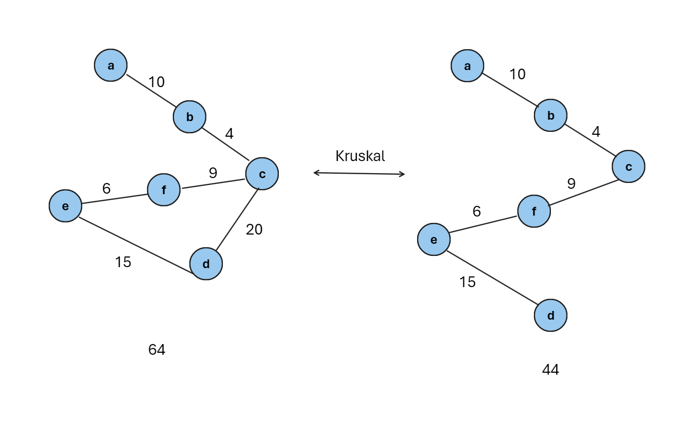

## What is Kruskal Algorithms
Kruskal's Algorithm is used to find the minimum spanning tree for a connected weighted graph. The main target of the algorithm is to find the subset of edges by using which we can traverse every vertex of the graph. It follows the greedy approach that finds an optimum solution at every stage instead of focusing on a global optimum.

## How To Work Kruskal Algorithms
1- Sort all the edges in non-decreasing order of their
2- Pick the smallest edge. Check if it forms a cycle with the spanning tree formed so far. If the cycle is not formed, include this edge. Else, discard it. 
3- Repeat step#2 until there are (V-1) edges in the spanning tree.

## for examples
